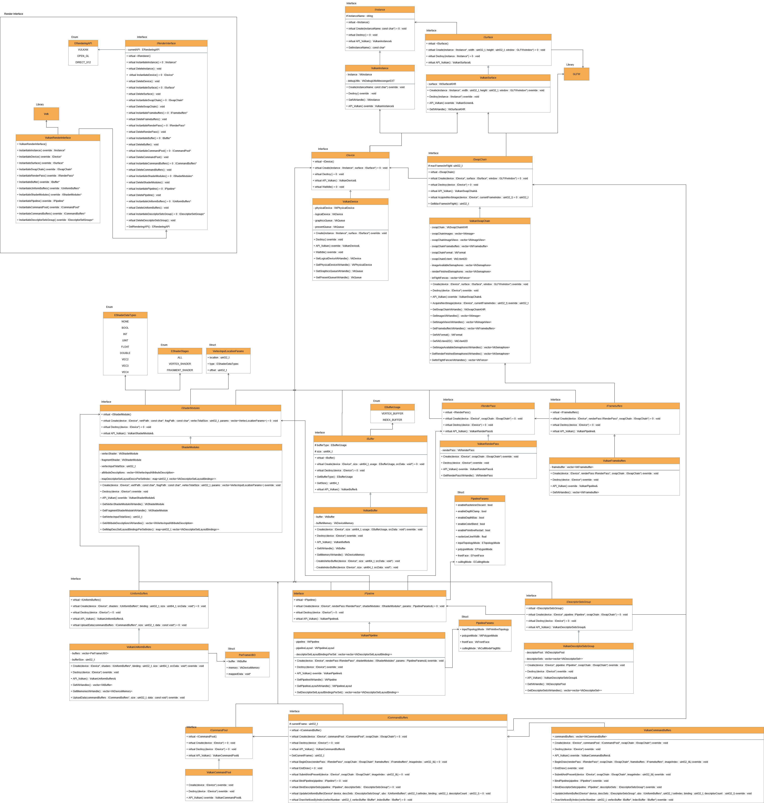

# MaliceRHI - Rendering Hardware Interface

MaliceRHI is a school project made under 3 weeks by Diego FRAUEL CASTRO.\
ISART Digital, GP2 - 2025/2026
## Summary

- [Overview](#overview)  
- [Architectural Summary](#architectural-summary)  
- [Most important features](#most-important-features)

### Classes  
- [IRenderInterface / VulkanRenderInterface](#irenderinterface--vulkanrenderinterface)  
- [IInstance / VulkanInstance](#iinstance--vulkaninstance)  
- [ISurface / VulkanSurface](#isurface--vulkansurface)  
- [IDevice / VulkanDevice](#idevice--vulkandevice)  
- [ISwapChain / VulkanSwapChain](#iswapchain--vulkanswapchain)  
- [IRenderPass / VulkanRenderPass](#irenderpass--vulkanrenderpass)  
- [IFramebuffers / VulkanFramebuffers](#iframebuffers--vulkanframebuffers)  
- [IShaderModules / VulkanShaderModules](#ishadermodules--vulkanshadermodules)  
- [IPipeline / VulkanPipeline](#ipipeline--vulkanpipeline)  
- [IBuffer / VulkanBuffer](#ibuffer--vulkanbuffer)  
- [IUniformBuffers / VulkanUniformBuffers](#iuniformbuffers--vulkanuniformbuffers)  
- [IDescriptorSetsGroup / VulkanDescriptorSetsGroup](#idescriptorsetsgroup--vulkandescriptorsetsgroup)  
- [ICommandPool / VulkanCommandPool](#icommandpool--vulkancommandpool)  
- [ICommandBuffers / VulkanCommandBuffers](#icommandbuffers--vulkancommandbuffers)

### Usage Examples  
- [Example of User-Side Initialization](#example-of-user-side-initialization)

## Overview

MaliceRHI is a student project that implements a small Rendering Hardware Interface (RHI) designed to abstract low-level graphics APIs.  
The goal is to let applications create and use rendering resources (buffers, pipelines, command buffers, descriptor sets, uniform buffers, etc.) without interacting with Vulkan directly.

All interactions go through minimalistic interface classes, and each interface has a Vulkan backend implementation.
This keeps user code clean and independent from the graphics API while still exposing the most explicit control over GPU resources.

The project is structured as a static library (`malice_rhi.lib`) and a separate executable that uses it in a test/demo project.
Although only Vulkan is implemented for now, the design makes it possible to add other graphics APIs later. Please also note that this is our first Vulkan experience/project ever, coming from OpenGL training (modern and legacy).

## Architectural Summary

```
(User Application)
       |
       v
  IRenderInterface
       |
       +--- IInstance              --> VulkanInstance
       +--- IDevice                --> VulkanDevice
       +--- ISurface               --> VulkanSurface
       +--- ISwapChain             --> VulkanSwapChain
       +--- IRenderPass            --> VulkanRenderPass
       +--- IFramebuffers          --> VulkanFramebuffers
       +--- IShaderModules         --> VulkanShaderModules
       +--- IPipeline              --> VulkanPipeline
       +--- ICommandPool           --> VulkanCommandPool
       +--- ICommandBuffers        --> VulkanCommandBuffers
       +--- IBuffer                --> VulkanBuffer
       +--- IUniformBuffers        --> VulkanUniformBuffers
       +--- IDescriptorSetsGroup   --> VulkanDescriptorSetsGroup
```

Each interface is implemented exactly once per backend. The user only interacts with the interface layer and remains entirely unaware of Vulkan objects.

---


Here is the UML Class Diagram of the project, with most important classes, methods per classes, and some dependencies like Volk and GLFW.

## Most important features

- Runtime selection of rendering backend (dynamic RHI)
- Explicit and constant object lifetimes (`Create(...)` / `Destroy(...)`)
- Separation of concerns across instance, device, pipeline, buffer, and descriptor management while simplifying as much as possible the verbosity of Vulkan, while giving the user some control on the backend settings
- Per-frame resource allocation where appropriate (uniform buffers, descriptor sets)
- User customizable graphics pipeline, uniforms and vertex input data
- Resizable window supported.

# Classes

## IRenderInterface / VulkanRenderInterface

### Purpose
Acts as a factory for all RHI objects. The user obtains all rendering resources through this interface.

### Primary Responsibilities
```cpp
IInstance*            InstantiateInstance();
IDevice*              InstantiateDevice();
ISurface*             InstantiateSurface();
ISwapChain*           InstantiateSwapChain();
IRenderPass*          InstantiateRenderPass();
IFramebuffers*        InstantiateFramebuffers();
IPipeline*            InstantiatePipeline();
ICommandPool*         InstantiateCommandPool();
ICommandBuffers*      InstantiateCommandBuffers();
IBuffer*              InstantiateBuffer();
IUniformBuffers*      InstantiateUniformBuffers();
IDescriptorSetsGroup* InstantiateDescriptorSetsGroup();
IShaderModules*       InstantiateShaderModules();
```
As well as a function for each class to use C++'s `delete _ptr` on each pointer to deallocate them.

---

## IInstance / VulkanInstance

### Purpose
Represents the rendering API instance.

### Vulkan Implementation Contains
- `VkInstance`
- Debug messenger
- Validation layers
- Surface support utilities

## ISurface / VulkanSurface

### Purpose
Abstraction of the windowing surface.

### Vulkan Implementation Contains
- `VkSurfaceKHR`

## IDevice / VulkanDevice

### Purpose
Encapsulates the physical and logical Vulkan device.

### Vulkan Implementation Contains
- `VkPhysicalDevice`
- `VkDevice`
- Queue family indices
- Graphics and presentation queues

## ISwapChain / VulkanSwapChain

### Purpose
Represents the swap chain and frame presentation infrastructure.

### Vulkan Implementation Contains
- `VkSwapchainKHR`
- Swap chain images and image views
- Synchronization objects per frame (semaphores, fences)
- Swap chain configuration utilities

## IRenderPass / VulkanRenderPass

### Purpose
Describes the render pass used for draw operations.

### Notes
- Currently supports a single color attachment
- Depth is not yet implemented

## IFramebuffers / VulkanFramebuffers

### Purpose
Contains one framebuffer per swap chain image. Created after both swap chain and render pass.

## IShaderModules / VulkanShaderModules

### Purpose
Loads SPIR-V shader modules and provides both shader handles and pipeline input descriptions.\
**Note :** the user must provide compiled SPIR-V shaders, not simply the written shaders.

### Additional Responsibilities
- Vertex input attribute descriptions
  - Location
  - Variable data type
  - Offset from start of Vertex data.

```cpp
struct VertexInputLocationParams
{
	uint32_t location = 0;
	uint32_t memoryOffset = 0;
	EShaderDataType type = NONE;
};
```

Example registration of a Vertex containing a vec2 position and a vec3 color:
```cpp
uint32_t vertexTotalSize = sizeof(UserVertex);

VertexInputLocationParams posParams;
posParams.location = 0;
posParams.type = VEC2;
posParams.memoryOffset = offsetof(UserVertex, UserVertex::pos);

VertexInputLocationParams colorParams;
colorParams.location = 1;
colorParams.type = VEC3;
colorParams.memoryOffset = offsetof(UserVertex, UserVertex::color);

std::vector<VertexInputLocationParams> params = { posParams, colorParams };
```
The user must provide these parameters (total size of vertex and individual input settings) at the creation of the shaders.

- Descriptor set layout definitions, including:
  - Set index
  - Binding index
  - Descriptor count
  - Shader stage flags
  - Descriptor type

Example registration:
```cpp
shaders->AddDescriptorBinding(0, 0, 1, FRAGMENT_SHADER);
shaders->AddDescriptorBinding(0, 1, 1, VERTEX_SHADER);
shaders->AddDescriptorBinding(1, 0, 1, ALL);
```
The user can call these methods whenever, as long as it's before the pipeline creation after which the pipeline will record the state of the shaders and will stay fixed unless it is manually recreated.

## IPipeline / VulkanPipeline

### Purpose
Represents a fully configured graphics pipeline.

### Vulkan Implementation Contains
- `VkPipeline`
- `VkPipelineLayout`
- Descriptor set layouts derived from shader module bindings
- Vertex input configuration
- Almost fully customizable rasterizer settings (with default settings shown below), to be provided by the user upon pipeline creation. All the enums are abstract, and are later translated into their Vulkan equivalents : 

```cpp
struct PipelineParams
{
	ETopologyMode inputTopologyMode = TRIANGLE_LIST;
	EPolygonMode polygonMode = FILL;
	EFrontFace frontFace = COUNTER_CLOCKWISE;
	ECullMode cullingMode = CULL_BACK_FACE;
	float rasterizerLineWidth = 1.0f;
	bool enableRasterizerDiscard = false;
	bool enableDepthClamp = false;
	bool enableDepthBias = false;
	bool enableColorBlend = false;
	bool enablePrimitiveRestart = false;
};
```

## IBuffer / VulkanBuffer

### Purpose
General-purpose GPU buffer supporting:
- Vertex buffers
- Index buffers
- Staging buffers (internally)
- General device-local buffers

### Vulkan Implementation Contains
- `VkBuffer`
- `VkDeviceMemory`

## IUniformBuffers / VulkanUniformBuffers

### Purpose
Manages one uniform buffer per frame-in-flight.

### Features
- Persistent CPU mapping for each UBO
- Automated per-frame indexing
- Easy data upload interface:
```cpp
ubo->UploadData(ICommandBuffers* commandBuffers, uint32_t dataSize, const void* dataPtr);
```

## IDescriptorSetsGroup / VulkanDescriptorSetsGroup

### Purpose
Owns all descriptor sets and the descriptor pool for a given pipeline.

### Responsibilities
- Create descriptor pool
- Allocate descriptor sets per frame
- Used during commands recording to update/bind uniform buffers and send them to the GPU.

## ICommandPool / VulkanCommandPool

### Purpose
Owns and manages the Vulkan command pool from which command buffers are allocated.

## ICommandBuffers / VulkanCommandBuffers

### Purpose
Represents a set of command buffers, typically one per frame-in-flight.

### Supported Operations
- Begin/End render pass / recording commands.
- Bind graphics pipeline
- Bind descriptor sets
- Issue draw calls, with given index and vertex buffers.
- Submit work and present images
- Update uniform buffers at a given set+binding, with a given count for each binding (useful for lists/arrays).

Example usage:
```cpp
commands->BindDescriptorSets(pipeline, descriptorSets)
commands->BindUniformBuffer(device, descriptorSets, modelMat, 0, 0, 1);       // Set 0, binding 0, count = 1.
commands->BindUniformBuffer(device, descriptorSets, viewMat, 0, 1, 1);        // Set 0, binding 1, count = 1.
commands->BindUniformBuffer(device, descriptorSets, projMat, 0, 2, 1);        // Set 0, binding 2, count = 1.
commands->BindUniformBuffer(device, descriptorSets, mvpMatsStruct, 1, 0, 1);  // Set 1, binding 0, count = 1, even for a struct with several data inside.
```

# Example of User-Side Initialization

```cpp
#include <malice_thi/malice_rhi.h>

#include <GLFW/glfw3.h>       // Mandatory for window handling.
#include <glm/glm.hpp>        // Recommended for sending types to the shaders.

IRenderInterface* RHI = new VulkanRenderInterface();

IInstance* instance = RHI->InstantiateInstance();
instance->Create("Malice RHI");

ISurface* surface = RHI->InstantiateSurface();
surface->Create(instance, windowHandle);

IDevice* device = RHI->InstantiateDevice();
device->Create(instance, surface);

ISwapChain* swapChain = RHI->InstantiateSwapChain();
swapChain->Create(device, surface, windowHandle);

...

swapChain->Destroy(device);
RHI->DeleteSwapChain(swapChain);
swapChain = nullptr;

... 
```
**Note :** This RHI depends heavily on GLFW for the window handle. It is not currently possible to use any other way such as SDL or other.

Pipeline and draw example:
```cpp
commands->BeginDraw(renderPass, swapChain, framebuffers, imageIndex);
  commands->BindPipeline(pipeline);
  commands->BindDescriptorSets(pipeline, descriptorSets);
  commands->DrawIndexed(indexCount, vertexBuffer, indexBuffer);
commands->EndDraw();
```

For a full demo, look inside the folder `./tests/MaliceFwdRenderer/` to see more code.
